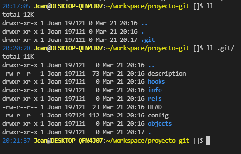
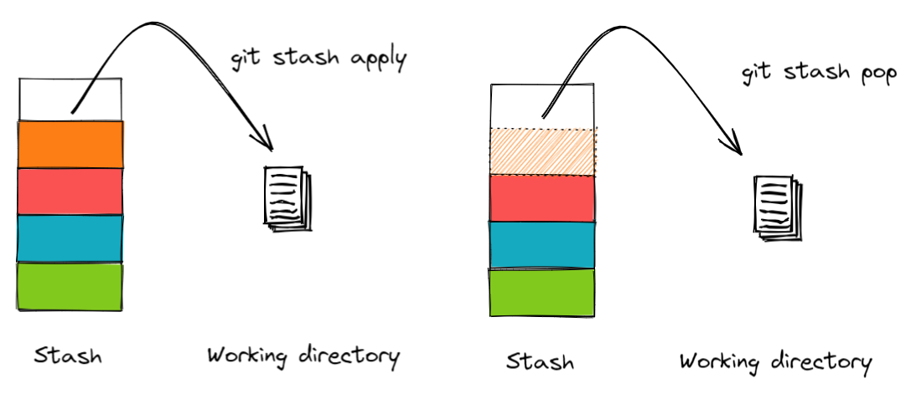
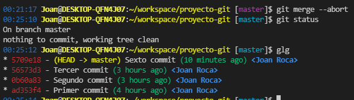

# Taller de Git

Creado por Joan Roca para Hiberus

Contenidos:
- [Instalacion](#instalación)
- [Los primeros pasos](#los-primeros-pasos)
- [El commit inicial](#el-commit-inicial)
- [Inspeccionando el histórico de git](#inspeccionando-el-histórico-de-git)
- [Tageando commits](#tageando-commits)
- [Visualizando cambios](#visualizando-cambios)
- [EJERCICIO 1 - Afianzando conceptos básicos](#ejercicio-1)
- [Deshaciendo cambios](#deshaciendo-cambios)
    - [De un fichero en estado modified](#de-un-fichero-en-estado-modified)
    - [De un fichero en estado staged](#de-un-fichero-en-estado-staged)
    - [De un fichero en estado untracked](#de-un-fichero-en-estado-untracked)
    - [Deshaciendo commits](#deshaciendo-commits)
    - [Eliminando commits](#eliminando-commits)
- [EJERCICIO 2 - Manipulando el workspace](#ejercicio-2)
- [El stash](#el-stash)
- [Ramas](#ramas)
    - [Creación de ramas](#creación-de-ramas)
    - [Moverse entre ramas](#moverse-entre-ramas)
- [EJERCICIO 3 - Reseteando ramas](#ejercicio-3)
- [Merge de ramas](#merge-de-ramas)
    - [El merge fast-forward](#el-merge-fast-forward)
    - [El merge fast-forward con commit de merge](#el-merge-fast-forward-con-commit-de-merge)
    - [El merge non-fast-forward](#el-merge-non-fast-forward)
    - [El merge con conflictos](#el-merge-con-conflictos)
- [El rebase](#el-rebase)
    - [Caso facil](#caso-facil)
    - [Caso conflictivo](#caso-conflictivo)
- [EJERCICIO 4 - Mergeando ramas](#ejercicio-4)
- [El cherry-pick](#el-cherry-pick)

## Instalación

Si usas Linux o MacOS: https://git-scm.com/book/en/v2/Getting-Started-Installing-Git
Si usas Windows: https://gitforwindows.org/

Una vez instalado, abre una nueva terminal Bash (GitBash en Windows) y copia los ficheros de la carpeta `terminal` a tu `HOME`. Para ello, desde la carpeta raíz de este proyecto usa el comando `cp terminal/* ~/`. Si ya tienes tu propio fichero `.bashrc` puedes revisar el fichero de este proyecto y ponerlo a continuación. El contenido són una serie de alias muy útiles, además de un prompt mejorado y adaptado para git. 

## Los primeros pasos

Lo primero que vamos a hacer es crearnos un nuevo proyecto Git. Para ello ejecutaremos el comando `mkdir ~/proyecto-git`. Si queremos podemos crearla en otra carpeta que no sea nuestra `HOME`. Para ello navegaremos a la carpeta en cuestión y ejecutaremos `mkdir proyecto-dir`. A continuación entraremos en la carpeta ejecutando `cd proyecto-git`

Para iniciar un proyecto git escribiremos `git init`. Este comando se puede ejecutar tanto en carpetas vacías como en un proyecto ya empezado pero que no tiene aún git y lo que hace es generar una base de datos en la carpeta `.git`, que contiene toda la información y configuración que git necesita. 



## El commit inicial

Vamos a añadir nuestro primer commit. Para ello, necesitaremos crear como mínimo un fichero y añadirlo al commit. Escribiremos `touch holamundo.txt` para crear un nuevo ficheros. A continuación ejecutaremos el comando `git status`. Este comando nos muestra el estado actual del workspace de nuestro proyecto. Recordemos que los ficheros de nuestro proyecto pueden estar en 4 estados: `untracked`, `modified`, `staged` y `unmodified`. En este caso, holamundo.txt está en estado `untracked`, ya que lo acabamos de crear y git no tiene guardada ninguna versión de el. 


Para que git lo siga, lo que tenemos que hacer es añadirlo al `stage`. El `stage` es el estado que tienen los ficheros que se van a commitear. Si un fichero no esta en el `stage`, aunque hagamos un nuevo commit, este fichero no se va a incluir en el commit. Para añadir un fichero al `stage` ejecutaremos `git add <nombre-fichero>`. 

 

Hay variaciones del `git add` mas útiles:
- `git add .`: Añade TODOS los ficheros que tienes modificados o untracked al stage. 
- `git add -p`: De forma interactiva, paseate por todos los ficheros modificados y decide si incluyes o no los cambios. <--- RECOMENDADO

Una vez hayamos hecho nuestro primer `git add`, vamos a ejecutar `git status` para ver como ha quedado nuestro workspace. Deberíamos tener lo mismo que en la imagen de mas arriba. Vamos ahora añadir algo al fichero holamundo.txt. Podemos añadirle una línea que ponga `Hola Mundo!` (muy original). A continuación guardaremos y ejecutaremos otra vez `git status`.


Como vemos, tenemos el fichero en dos estados a la vez. Eso se debe porque hemos añadido el fichero al `stage` y luego hemos hecho mas cambios, que no hemos stageado. Si ahora hicieramos un commit, solo se commitearía el fichero vacío. La frase "Hola Mundo!" que hemos escrito despues del `git add` no entraría en el commit. Para incluir también esa frase, deberemos ejecutar otra vez `git add -p`.

Una vez hecho esto, vamos a hacer nuestro primer commit. Para crear un commit ejecutaremos el comando `git commit -m "<mensaje del commit>"`. 


Vamos a hacer un par de commits mas para añadirle un poco mas de chicha a este proyecto. A continuación editaremos el fichero holamundo.txt y lo dejaremos así:


También crearemos un nuevo fichero al que llamaremos aprendiendo-git.txt. Los añadiremos los 2 al `stage` y haremos nuestro segundo commit con un `git commit -m "Segundo commit"`. 

Luego, haremos un tercer commit. Para ello cambiaremos los ficheros de la siguiete forma y ejecutaremos  `git commit -m "Tercer commit"`:


## Inspeccionando el histórico de git

Hemos hecho 3 commits en nuestro proyecto. Para verlos podemos usar el comando `git log`:


Ahí podemos ver "claramente" los tres commits que hemos hecho, con su id, el autor, la fecha del commit y el mensaje del commit. De todas maneras, el output standard del git log me parece bastante feo. Por ello, en el fichero `.bashrc` que os he pasado hay un `alias glg="git log --graph --pretty=format:'%Cred%h%Creset -%C(yellow)%d%Creset %s %Cgreen(%cr) %C(bold blue)<%an>%Creset' --abbrev-commit"` que usando magia negra nos transforma el git log en algo bastante mejor. Podemos escribir `glg` para ver el output:


Recomiendo usar siempre este alias, ya que como veremos mas tarde con las ramas, el output es bastante mejor. No obstante, podemos si queremos usar algún programa externo que nos muestre por pantalla. Yo uso la extensión del VSCode `Git History`:


## Tageando commits

Una funcionalidad bastante útil en git son los `tags` o etiquetas. Un tag no es nada mas que un puntero a un commit concreto. Los tags se usan sobretodo para etiquetar releases o versiones de una aplicación y así poder llegar a ellas facilmente. Para hacer un tag simplemente ejecutaremos `git tag <nombre-del-tag>`. Por ejemplo `git tag v0.1` por ejemplo. El tag se enganchara al commit al que apunta nuestro `HEAD` en ese momento. En nuestro caso, al "Tercer commit". 


A partir de ahora, el tercer commit esta tageado con la versión 0.1. En un futuro, si lo necesitamos podremos acceder a ese commit directamente usando el tag.

Para eliminar un tag usando la instrucción `git tag -d <nombre-del-tag>`. Para eliminarlo del remoto usaremos además la instruccion `git push origin :refs/tags/<nombre-del-tag>`


## Visualizando cambios

Para ver que cambios tiene un commit en concreto podemos usar el comando `git show <id-del-commit>`. El id del commit lo vamos a usar con frequencia, y es el numerillo que sale en rojo cuando escribimos `glg`. Por ejemplo, si queremos ver los cambios que incluía el tercer commit:


De todas maneras, existen herramientas mas cómodas para visualizar estos cambios. Yo recomiendo la herramienta standard de Visual Studio


Recomiendo que jugueis un poco con la herramienta del Visual Studio y veáis todo lo que puede hacer. Podeis examinar los cambios de un commit, las diferentes versiones de un fichero, de una línea en concreto de un fichero, etc. Es una herramienta que usada bien te puede sacar de mas de un problema.

## Ejercicio 1

A continuación vamos a realizar un ejercico para consolidar todo lo que hemos visto hasta ahora. Para preparar el entorno deberemos ejecutar `./exercises/1-exercise.sh`. Este es un script shell que he preparado para el ejercicio. Este script os va a crear una carpeta llamada `ejercicio1` justo fuera de este proyecto. Si os da error de permisos al ejecutar la instrucción, ejecutad `chmod +x exercises/*`. Esta instrucción da permisos de ejecución a todos los scripts que usaremos para pre-generar los ejercicos. Una vez ejecutado correctamente el comando `./exercises/1-exercise.sh` debeís entrar a la carpeta y ejecutar los comandos git necesarios para contestar las siguientes preguntas:
- Cuantos commits hay?
- Que se ha hecho exactamente en el último commit?
- Cuantos tags hay?
- Eliminar el primer tag y moverlo un commit mas allá
## Deshaciendo cambios

Hasta ahora hemos visto como añadir cambios. Hemos añadido un fichero a un commit, hemos añadido varios commits al histórico de nuestra rama master e incluso hemos añadido un tag. Ahora veremos la operación contraria para cada uno de los casos.

### De un fichero en estado modified


Para deshacer los cambios de un fichero modificado, pero que no está en el `stage` ejecutaremos la instrucción `git restore <nombre-del-fichero>`. Si queremos deshacer los cambios en todos podemos usar `git restore .`

### De un fichero en estado staged


Para deshacer los cambios de un fichero modificado y en `stage` ejecutaremos la instrucción `git restore --staged <nombre-del-fichero>`. Fijaros que del estado `staged` pasamos siempre al modified. Por lo tanto, se quedará en estado modified. Si queremos limpiarlo deberemos ejecutar la instrucción anterior

### De un fichero en estado untracked


La instrucción `git clean -fd` limpia **todos** los ficheros que están untracked. La opcion `-d` la incluimos para que borre ficheros y directorios untracked.

### Deshaciendo commits

Deshacer un commit significa eliminarlo del histórico de git y quedarse con sus cambios. Para deshacer un commit tenemos que tener en cuenta que no podemos hacerlo si esta ya commits mas recientes. Osea, que solo podemos deshacer el último commit o los X últimos commits. Para ello usaremos la instrucción `git reset <id-del-commit>`. Esta instruccón nos deshará todos los commits hasta el que tenga esa id **sin incluirlo**. 

Por ejemplo, en nuestra rama master, que tenemos 3 commits. Podemos deshacer el mas reciente así.


Como vemos, hemos deshecho el commit mas reciente y nos ha dejado los cambios en modified. Otra manera de hacer exactamente lo mismo es ejecutando `git reset HEAD~1`. `HEAD` es siempre un puntero que apunta a el commit mas reciente de la rama donde estemos actualmente. Lo que le estamos diciendo es que deshaga los commits empezando desde HEAD y tirando 1 commit atrás. 


### Eliminando commits

En el punto anterior hemos visto como deshacer un commit. Pero... ¿y si nos interesa eliminarlo del todo? Podemos deshacerlo y hacer un `git restore .` por ejemplo. Pero yo prefiero el `git reset --hard <id-del-commit>`. Esta instrucción es muy útil para resetear ramas enteras por ejemplo. Tenemos que pensar que el git reset --hard es como mover un puntero de un commit a otro. 


### Ejercicio 2

A continuación vamos a realizar el segundo ejercicio del taller. Para preparar el entorno deberemos ejecutar `./exercises/2-exercise.sh`. Este script os va a crear una carpeta llamada `ejercicio2` justo fuera de este proyecto. Debeís entrar a la carpeta y ver el estado del proyecto (en lo que al control de versiones se refiere). Para completar este ejercicio deberéis:
1. Eliminar un commit (seguro que os dais cuenta de cual)
2. Hacer un nuevo commit con el siguiente contenido:
    - El fichero hello.txt solo deberá quedarse con 2 lineas. La que dice Hello World y la que dice Adios Mundo
    - El fichero test2.txt
3. Todo lo demas deberá quedar fuera del commit. Y deberemos terminar con el workspace limpio. 

NOTA: Si la liais mucho y quereis empezar de nuevo. Ejecutar otra vez el comando `./exercises/2-exercise.sh`
## El stash

Una herramienta muy útil dentro de git es el stash. Hemos de imaginar el stash como una caja donde vamos apilando cambios. Cambios que no necesitamos, pero que nos gustaría recuperar mas tarde. Una situación habitual que nos encontramos con frecuancia es, al desarrollar en local quizas tenemos que cambiar un par de propiedades de configuración de nuestro proyecto. Por ejemplo, la ip de la base de datos, o el endpoint de un servicio local. Estos cambios no los queremos comitear nunca, ya que solo nos sirven a nosotros en nuestro ordenador. Y cuando desarrollamos siempre necesitamos que esten cambiados. Lo que haremos entonces es cambiarlos y a la hora de commitear stashear el fichero de configuración. Hacer el commit y una vez empieze con otro desarrollo sacamos del stash esos cambios. 

Es importante saber que el stash tiene una restricción en su uso. Se comporta como una pila (donde apilas cosas). Esto es, para sacar una cosa que está al fondo, necesitas sacar lo que hay encima.  


Para desapilar los cambios tenemos 2 posibilidades. Desapilar sacando del stash los cambios, o dejandolos. 



Hay otra forma de desapilar los cambios del stash. Que nos va a permitir cambios que **no** son los mas recientes. Si ejecutamos `git stash list` podemos ver todo lo que hay guardado en la pila. Y con la instruccion `git stash [pop|apply] --index <num>` podremos desapilar el cambio que queramos. Vamos a verlo. 

En el siguiente ejemplo voy a hacer tres modificaciones y las voy a stashear las tres por separado. Creandome una stash con 3 cambios. Además, voy a poner un mensaje a cada uno de esos cambios para que me sea mas fácil luego encontrar el cambio que quiero.


Como vemos, al crear los dos primeros stashes les he puesto un mensaje. Pero en el tercero he decicido no poner ninguno. Al visualizarlos, vemos que git, si no ponemos mensaje nos pone el mismo un mensaje automático. Ahora podemos desapilar uno de entre medio del stash:


## Ramas

Hasta el momento hemos estado trabajando con una sola rama. La rama `master`. Por convención, la rama `master` es la primera rama del repositorio y también la rama principal. Podemos ver las ramas que tenemos ejecutando `git branch`.


### Creación de ramas


A continuación vamos a crear una nueva rama. Ejecutaremos `git checkout -b <nombre-de-la-nueva-rama>` para crearla. Hay que tener en cuenta que la rama que creamos cuando ejecutamos esta instrucción se crea a partir de la rama en que estemos situados en este momento. 


Como se ve en la imagen, al crear la rama te mueve automáticamente a ella. Además, la nueva rama es una copia exacta de la original.

### Moverse entre ramas


Para movernos entre ramas, usaremos el comando `git checkout <nombre-de-la-rama>`. Por ejemplo, para volver a la rama master.


### Ejercicio 3

A continuación vamos a realizar el tercer ejercicio del taller. Para preparar el entorno deberemos ejecutar `./exercises/3-exercise.sh`. Este script os va a crear una carpeta llamada `ejercicio3` justo fuera de este proyecto. Debeís entrar a la carpeta y ver el estado del proyecto (en lo que al control de versiones se refiere). Para completar este ejercicio deberéis:
1. Resetear la rama master y dejar solo el primer commit
2. Hacer alguna modificación (crear nuevo fichero, modificar uno ya existente, ...) y commitear los cambios
3. Igualar la otra rama del proyecto a master. (Resetear de master)

NOTA: Si la liais mucho y quereis empezar de nuevo. Ejecutar otra vez el comando `./exercises/3-exercise.sh`

## Merge de ramas

Es importante saber que cada rama es independiente de las demás. Si añadimos un commit en una rama, las demás ramas no verán ese commit. Para integrar los commits de una rama en otra rama. Por ejemplo para integrar los commits de una rama donde estamos desarrollando una feature en master, que es la rama principal, deberemos hacer lo que se conoce como merge. Como vamos a ir experimentario con varias estrategias de merge, vamos a crearnos una rama *backup* de master para poder ir restaurando el estado inicial.

Desde `master` ejecutaremos `git checkout -b master-backup` y la dejaremos ahí de momento.

Vamos ahora a movernos a la rama que hemos creado en el punto anterior, la rama `feature/test-ramas` y haremos un par de commits mas. Para ello modificaremos los dos ficheros que tenemos, uno en cada commit.


### El merge fast-forward


Si nos fijamos en el `glg` del final, podemos ver claramente que master se ha quedado en el tercer commit, y nuestra nueva rama tiene dos commits mas. Vamos a fusionar esta rama con master para pasarle los commits. Para ello vamos a movernos a la rama master y usar la instrucción `git merge <nombre-rama>`. En este caso `git merge feature/test-ramas`


Como vemos, ha mergeado sin ningún problema los dos commits de la rama `feature/test-ramas`. Fijemonos en el mensaje que nos da, porqué es importante. Nos dice que el merge es *fast-forward*. Esta es la situación ideal. Y solo se dá si se cumplen que rama destino, en este caso `master` es un subconjunto de la rama origen. Esto es, `feature/test-ramas` es un clon de master al que se le han añadido uno o varios commits. Esta situación es increiblemente rara en un equipo de mas de una persona. Y a menudo la tendremos que forzar para conseguir que nuestros merges sean *fast-forward*.

### El merge fast-forward con commit de merge


De momento, vamos a experimentar un poco mas con los merges. Vamos a restaurar `master` al estado anterior. Para ello ejecutaremos `git reset --hard master-backup`. Esta instrucción borra literalmente todo lo que tengas en la rama actual y te pone lo que hay en la rama `master-backup`. Que recordemos era un clon de master. 

A continuación vamos a ver otro tipo de merge muy parecido al anterior. Es un merge también fast-forward pero este deja commit de merge para que en histórico quede constancia de que ahí habia una rama que se ha mergeado. Para ello, ejecutaremos `git merge feature/test-ramas --no--ff`.


Si nos fijamos, se ha creado un commit de merge adicional. Este commit le da información a git de que ahí habia una rama que se ha mergeado, y solo eso. Ese commit de merge es inocuo. No nos afecta en nada. No contiene código del proyecto. 

### El merge non-fast-forward


Como anteriormente, vamos a restaurar master al estado inicial ejecutando un `git reset --hard master-backup`. 
A continuación, haremos un commit en master. Un commit que cause no cause ningún conflicto con ninguno de los commits de la otra rama. Vamos pues a crear un nuevo fichero y lo vamos a añadir en un commit que se va a llamar "Sexto commit". 


Si ahora repetimos el merge anterior, `git merge feature/test-ramas` veremos que la cosa cambia.


En este caso, git ha detectado que **si** habia diferencia entre las dos ramas. A la rama origen del merge le faltaba un commit para ser un clon perfecto de master. Esta es la situación mas habitual que nos encontraremos cuando trabajemos en un equipo. En este caso git no puede hacer un merge fast-forward, o merge directo. Como sabe que las ramas han diferido y que es posible que haya conflictos entre commits. Lo que hace es, uno por uno, patearse todos los commits de la rama origen y los compara uno a uno con los commits de la rama origen a partir de donde empieza a divergir. En este caso, cojería primero el cuarto commit y lo compararía con el sexto commit. No habría conflictos así que ningun problema. Si master tubiera mas commits que el sexto, iría hasta el final, comparando uno a uno. Una vez terminado, pasaría a comparar el quinto commit con todos los commits de master, empezando por el sexto. A esto se le llama **estrategia recursiva**. Una vez finalizado el proceso, git crea un commit de merge vacío. Si hay conflictos en el merge, la resolución de los conflictos estaría en ese commit de merge. 

### El merge con conflictos


A continuación vamos a forzar un merge con un conflicto. Vamos a resetear master como hemos hecho anteriormente y crearemos un nuevo commit al que llamaremos "Sexto commit" en el que incluiremos un cambio que provoque conflictos con la otra rama. Podemos por ejemplo editar el fichero holamundo.txt y añadirle lo siguiente:


Recordemos que en el cuarto commit, en la otra rama habiamos editado ese mismo fichero con los siguientes cambios:


Eso debería ser suficiente para provocar conflictos. Vamos a intentar mergear a ver que ocurre.


Ha ocurrido lo que esperabamos. El fichero holamundo.txt no ha sido capaz de mergearse correctamente y el merge ha fallado. De todas maneras ahora mismo estamos en "modo merge". No podemos cambiar de rama. No podemos crear nuevas ramas. Solo podemos hacer dos cosas. Abortar el merge, dejandolo todo como estaba antes. O resolver los conflictos y finalizar el merge. 

Para abortar el merge ejecutaremos `git merge --abort`. 

#### La resolución de conflictos



Pero vamos a hacer lo que debemos hacer. Resolver conflictos y finalizar el merge. Si nos fijamos en la imagen anterior, la del merge, el status nos indica que en el merge se han cambiado dos ficheros, uno esta en verde y uno en rojo. El que está en verde ha funcionado. No debemos hacer nada. Solo hemos de mirar los rojos. Para ello, lo abriremos, idealmente con alguna herramienta tipo Meld o Diffmerge. Visual Studio está preparado también, aunque ni de lejos tiene las facilidades de Meld o Diffmerge. 


Si nos fijamos, Visual Studio nos marca los conflictos con dos colores. El Current Change, de color verde es lo que ya hay y que está provocando conflictos en la rama master, donde vamos a integrar los cambios. El Incoming Change, de color azul es lo que nos esta viniendo y que provoca conflictos. ¿Con que nos quedamos? Pues depende del conflicto. Esto no es sota, caballo, rey. Es decisión de cada desarrollador saber que código es el mas correcto. Quizas es uno, quizas es otro, quizas una mezcla de los dos. Por ejemplo, yo aquí tengo la posibilidad de quedarme solo con lo que ya había. Solo con lo que va a venir. O con una mezcla. Para este ejemplo, lo que vamos a hacer es una mezcla. Como en el commit de master lo que hemos hecho ha sido añadir una exclamación al hello world, lo que haremos ahora es quedarnos con lo que nos viene pero añadiendole una exclamación al hello world. Y además, porque nos parece correcto también añadiremos una exclamación de apertura. El fichero entonces nos quedaría así:


Perfecto, conflicto resuelto. A continuación, como hemos hecho cambios en el fichero (hemos resuelto los conflictos), lo meteremos en el `stage` y si hubiera otros ficheros con conflicto los resolveríamos también. Una vez todos los ficheros estén en verde (en el output del git status), podremos continuar con el merge ejecutando `git merge --continue`


Como vemos en el log, el resultado de mergear dos ramas non fast-forward son los commits de ambas ramas unificados por un commit de merge final. Además, en este caso el commit de merge contiene la resolución de los conflictos. Ese commit de merge ha pasado a ser una **parte integral** de la historia de la rama. Y eso no es bueno. Otra cosa que choca es el orden de los commits. Si nos fijamos el glg nos dice que el Sexto commit va **antes** de los de la otra rama. Pero el git log nos dice algo muy diferente.


De cual nos fiamos? Pensad que esto es importante a la hora de hacer operaciones que veremos luego como resets, reverts, etc. Si quiero volver atrás, hasta el sexto commit. No se si me voy a cargar el quinto y el cuarto. O van a seguir estando. **Este tipo de merges nos dificulta mucho la posterior manupulación de la historia**. Lo que queremos nosotros es una historia linear, fast-forward. Idealmente lo que querríamos siempre es o bien un **merge fast-forward** o uno **fast-forward con commit de merge**. Para ello, disponemos de un comando que nos "arregla" nuestra rama para que sea fast-forward con la rama contra la que queremos mergear. Vamos a ver el **git rebase**.

## El rebase

La idea del rebase cambiar o actualizar el punto de partida de tu rama, para ponerla al día con la rama destino. Normalmente rebasearemos siempre de la rama en la que queramos integrar nuestros cambios. En este caso master. Si nosotros tenemos nuestra rama, que sacamos de master hace una semana. Y en esa semana hay otros desarrolladores que han mergeado sus desarrollos en master. Nuestra rama ha quedado desactualizada y, en el mejor de los casos a la que mergeemos nos hará un **merge non-fast-forward**. Podemos arreglar esta siguación rebaseando nuestra rama con master. Esto es, bajandonos los cambios de master, estos commits extras que han introducido los otros desarrolladores, a nuestra rama. Dejandola como se acabara de crearse en ese mismo instante de master. 


Después de realizar el rebase, el primer commit de nuestra rama tendrá como padre el último commit de master. Esto es, master estará perfectamente contenido en nuestra rama. Con lo cual podremos hacer un merge fast-forward cuando queramos.

### Preparación

Para experimentar con el rebase necesitaremos tener a mano un backup de la rama de feature. Vamos a movernos a ella y ejecutamos el comando `git checkout -b feature-backup`;

### El rebase sin conflictos

Vamos a ver tres casos típicos de rebase. El primero es el rebase sin conflictos. Para ello haremos el reset de master habitual y, como en el ejemplo del [merge non-fast-forward](#el-merge-non-fast-forward) nos iremos a master, crearemos un fichero nuevo y haremos un nuevo commit. Eso nos dejará en la situación de la imagen de arriba. 


Si nos movemos ahora a nuestra rama, y ejecutamos `git rebase master` actualizaremos nuestra rama con lo último de master. Con lo que nos traeremos el "Sexto commit" a nuestra rama.


Si ahora probamos a hacer un merge no deberíamos tener ningún problema.


Como podemos ver, este comando es muy útil y de debería ejecutar **siempre** antes de cada merge. ¿Pero que pasa si hay conflictos? Vamos a verlo

### El rebase con conflictos

Vamos a ponernos en la misma situación que en el del [merge con conflictos](#el-merge-con-conflictos). Reseteamos master y creamos un nuevo commit que modifique el fichero helloworld.txt y añada una exclamación al final de la primera línea. Entonces, nos movemos a la rama de la feature y intentamos hacer un rebase de master.


Si nos fijamos, hemos intentado ejecutar el rebase pero nos ha fallado. De hecho, si nos fijamos en todo lo que dice vemos que no ha podído rebasear el Cuarto commit. Que es justamente el que tiene conflictos con el Sexto commit que hay en master. Aquí, como en el merge, tenemos varias posiblidades. Podemos resolver los conflictos, igual que hemos hecho en el merge y a continuación ejecutar un `git rebase --continue`. Podemos abortar el rebase (`git rebase --abort`), o podemos skipear los conflictos. Esta última opción se puede usar en situaciones muy particulares que no veremos en este taller. Lo que querremos normalmente es resolver los conflictos y continuar con el rebase. Vamos a ello. 


Ahora que hemos resuelto los conflictos, añadido el fichero al `stage` y continuado el rebase. Podemos ver que en la rama se ha colao el nuevo commit de master, justo antes de los nuestros. ¿Pero donde está el código que ha resuelto los conflictos? En el caso del merge, era el propio merge que creaba al final de todo un commit adicional y metía ahi las correcciones que habiamos aplicado. En el caso del rebase, las correcciones **las aplica en el propio commit de nuestra rama que causaba el conflicto**. Y eso la verdad es que está muy muy bien. Ya que dejamos los commits como si los hubieramos empezado teniendo en cuenta el nuevo commit de master. 

## El revert

El revert es un comando que nos ofrece Git para, como indica su nombre revertir un commit. Lo que hace git cuando le indicamos que revierta un commit es **crear otro commit** que deshace lo que hemos hecho en el commit original. Si simplemente eliminaramos el commit, se cambiaría el historico de la rama. Y eso en las ramas públicas (master, develop) esta totalmente prohibido. Con el revert, podemos hacer como si eliminaramos el commit pero totalmente legal. De todas maneras, hay que tener en cuenta que un revert tiene implicaciones. 


### Caso facil

Vamos a probar y a jugar un poco con el revert. Vamos primero a hacer el caso mas sencillo. Para ello reseteamos master como lo hacemos habitualmente y vamos a revertir el Tercer commit. Primero cojemos su id y ejecutamos `git revert <id-del-commit>`. Rcordemos que uno de los cambios en el tercer commit ha sido añadir la frase "Git mola" en el fichero aprendientdo-git.txt. 


Por lo tanto, si revertimos el tercer commit, deberíamos ver el fichero vacío. Como si el tercer commit no hubiera existido nunca.


Efectivamente, comprobamos el fichero aprendiendo-git.txt y está vacío. Además, viendo el log comprobamos que efectivamente se ha creado un commit con un mensaje indicando que se ha revertido el Tercer commit. Podemos también hacer un revert del revert. Esto es, si revertimos el commit de revert lo dejaremos todo exactamente igual que antes. Pero con commits extras. 


Este comando es muy útil cuando ha subido algo a develop o a master y queremos sacarlo. Si en un futuro quisieramos activarlo de nuevo, el revert del revert nos lo soluciona. 

### Caso conflictivo

Que pasa entonces si hago el revert de un commit del que directamente, dependen commits posteriores? Por ejemplo, en nuestro caso, en el Segundo commit se crea el fichero aprendiendo-git.txt. Y en el Tercer commit se modifica. Por lo tanto, el tercer commit esta directamente unido al segundo. Sin el segundo no puede existir el tercero. ¿Que pasa entonces si revertimos el segundo commit?


Como no podía ser de otra manera. Nos han saltado conflictos. Git no sabe como proceder y nos pide ayuda. Si nos fijamos, no solo el fichero aprendiendo-git.txt tiene conflictos. Sinó que el otro fichero también. Vamos a examinar mas de cerca los conflictos. 


En el caso del holamundo.txt nos esta diciendo si nos quedamos con lo que había antes del commit que hemos revertido o con lo que hay despues del commit que hemos revertido. Osea, si nos quedamos con la versión del Primer commit o del Tercer commit. 

En el caso del fichero aprendiendo-git.txt, como hemos revertido el commit que lo creaba git pasa de todo y dice, oye. Te dejo lo que hay en el commit siguiente, el Tercer commit, tal cual. Si quieres hacer algo con ese fichero tu verás.

Como vemos, hay reverts que no tienen sentido. Por ejemplo, este que hemos hecho nosotros. Hemos revertido el commit que creaba un fichero, que en otros commits estamos cambiando... Por ello, hay veces que no puedes hacer un solo revert. Sino que tienes que empezar por anular los commits mas recientes, para después anular commits mas antiguos. Eso tiene sentido si nuestros commits son solo de una sola feature. Que es lo que debería ser.

## Ejercicio 4

En este ejercicio aplicaremos todos los conocimientos de merges y rebases que hemos visto. Para preparar el ejercicio ejecutaremos la instrucción `./exercises/4-exercise.sh`. Como siempre, esto nos creará una carpeta fuera de este proyecto llamada *ejercicio4* a la que debemos entrar y hacer algo de investigación. El objetivo del ejercicio es que usando `git merge` o alguna de sus variantes, `git rebase` y resolviendo conflictos que nos puedan salir deberemos terminar con:
- 5 commits **ordenados** en la rama master. El orden de los commits lo veremos enseguida (Primero, Segundo, Tercero, Cuarto y Quinto)
- El fichero hello.txt deberá contener las siguientes líneas, por ese orden y ni una mas ni una menos:
```sh
Bye World
Linus is a god
Git r00lz
```
## El cherry-pick

El cherry-pick es un comando muy útil que nos permite traspasar commits de una rama a otra. De forma individual. Lo podemos ver como un merge, pero de un commit y no de una rama. 


El commit que copiamos de una rama a otra no será el mismo commit. Ya que su padre ya no será el mismo. Y evidentemente al hacer cherry-pick también podemos tener conflictos. Pero en general es un commit muy útil para compartir funcionalidades parciales entre miembros de un equipo. 

## El rebase interactivo

El rebase interactivo es una herramienta que nos permite modificar de diferentes formas los commits de una rama. En particular, los tres usos mas frequentes del rebase interactivo son:


